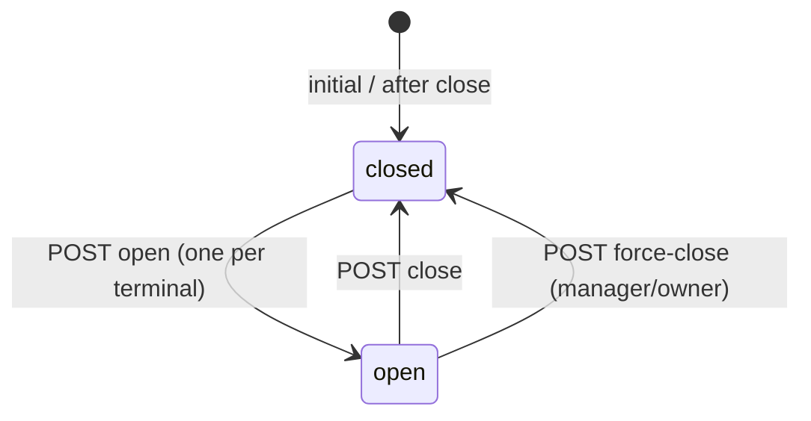

# M4-A — Shift Management RFC / Design

**Status:** DESIGN READY  
**Date:** 2026-08-12  
**Schema baseline:** v68 (post-M3 audit log)  
**Depends on:** M3 audit log (GREEN)  
**Does not implement:** Any application code, migrations, or UI

> **Authoritative for implementation:** This document + [ADR-007](../14-decisions/ADR-007-shift-model.md).  
> Source code overrides planning docs where they disagree.

---

## 1. Executive summary

FloCafe has no shift concept today. Orders are attributed to staff (`orders.user_id`), payments are recorded on bills (`bills.payment_details`), and reports aggregate by calendar day — but there is no cashier session, opening float, or register-scoped cash accountability.

**M4** introduces a **per-terminal shift** lifecycle: open → active → close. Shifts link to payments via `bills.shift_id` and optionally to orders via `orders.shift_id`. M4 records opening float and closing notes; **M5** computes expected cash, variance, and day close.

The design preserves existing POS workflows (orders, split payments, voids, partial payments) and integrates with the M3 audit service. A feature flag (`shifts_enabled`) allows incremental rollout without breaking current installs.

---

## 2. Current state

### 2.1 Staff and authentication

| Aspect | Verified behavior | Evidence |
|--------|-------------------|----------|
| Roles | `owner`, `manager`, `cashier`, `waiter`, `chef` | `main/routes/staff.ts`, `requireRole()` |
| Staff storage | `users` table (TEXT UUID ids) | `main/db.ts` `createSchema()` |
| Auth | JWT bearer; `req.user.userId` and `req.user.role` from DB on each request | `main/server.ts`, `main/middleware/security.ts` |
| Session invalidation | `tokens_valid_after` on password/PIN change | `main/routes/staff.ts`, `main/routes/auth.ts` |
| Manager PIN | Separate from login; used for void overrides | `main/routes/index.ts` (item cancel) |

**No shift or cashier-session entity exists.**

### 2.2 Orders

| Aspect | Verified behavior | Evidence |
|--------|-------------------|----------|
| Creation | `POST /api/orders` — `user_id` set from authenticated user, **not** client body | `main/routes/orders.ts` ~L316–407 |
| Idempotency | `order_idempotency` per user | `main/routes/orders.ts` |
| Status lifecycle | `pending` → `preparing` → `ready` → `served` → `completed` \| `cancelled` | `docs/01-requirements/business-rules.md` |
| Waiter scope | Waiters may only modify their own orders | `main/routes/orders.ts`, `main/routes/index.ts` |
| Transactions | Multi-table writes use `withTxn()` | `main/db.ts`, `main/routes/orders.ts` |

**Orders have no `shift_id` column today.**

### 2.3 Payments

| Aspect | Verified behavior | Evidence |
|--------|-------------------|----------|
| Entity | Payments apply to **bills**, not orders directly | `main/routes/bills.ts` |
| Endpoints | `POST /api/bills/:id/payment`, `POST /api/bills/:id/payments` (atomic batch) | `main/routes/bills.ts` |
| Methods | `cash`, `card`, `wallet`, plus `custom` via `payment_methods` table | `main/routes/bills.ts` `PAYMENT_METHODS`, migration v58 |
| Storage | `bills.payment_details` JSON array; each line has `method`, `amount`, `timestamp`, cash `tendered_amount`/`change_amount` | `applyPaymentBatch()` ~L659–683 |
| Status | `payment_status`: `unpaid`, `partial`, `paid` | `main/db.ts` bills schema |
| Precision | Amounts validated/stored with cent math (`paymentAmountCents`, `decimal.js` in tax paths) | `main/routes/bills.ts` |
| Idempotency | `payment_idempotency` scoped per user | `applyPaymentBatch()` |
| Split checks | `bills.split_group_id`, `split_label`; split before any payment | `main/routes/bills.ts` split-check route |
| Roles | Payment recording: `owner`, `manager`, `cashier` | `requireRole` on payment routes |

**No payment→shift association exists.**

### 2.4 Terminals / devices

| Concept | Exists? | Evidence |
|---------|---------|----------|
| Physical terminal registry | **No** | No `terminals` table |
| Cloud POS identity | **Yes** — `settings.cloud_pos_id`, `cloud_pos_hash` | `main/services/cloud-sync.ts`, `main/db.ts` |
| LAN multi-POS | **Yes** — QR via `GET /api/pos-info` | `main/routes/pos-info.ts` |
| Audit terminal context | **Yes** — `audit_logs.terminal_id` from `cloud_pos_id` when set | `main/services/audit-log.ts` |
| KDS “terminal” | Kitchen display only; unrelated to cash shifts | `main/routes/kds.ts` error strings |

**There is no first-class register/terminal entity.** M4 must introduce a stable `terminal_id` per POS client.

### 2.5 Cash handling

| Aspect | Verified behavior |
|--------|-------------------|
| Cash payments | Recorded in `payment_details` with `method: 'cash'`, optional `tendered_amount`, `change_amount` |
| Cash drawer kick | **Not implemented** (M8) |
| Opening float | **Not implemented** |
| Cash reconciliation | **Not implemented** (M5) |
| Reports | `GET /api/reports/daily-stats` sums `bills.paid_amount` for UTC day; payment method breakdown parses `payment_details` | `main/routes/reports.ts` |

### 2.6 Settings

Relevant keys today: `business_name`, `timezone`, `currency`, `country`, `kds_enabled`, cloud keys, privacy keys. **No shift-related settings.**

Timezone: `settings.timezone` (default `Asia/Kolkata`) used for receipt formatting and some report bucketing — day boundaries in `daily-stats` use **UTC** (`utcTodayDate()`).

### 2.7 Audit (M3)

- `audit_logs` table (v68), `logAuditEvent()` in `main/services/audit-log.ts`
- Append-only; owner/manager read via `GET /api/audit-logs`
- Transactional when called inside `withTxn()`

**No shift audit events exist yet.**

### 2.8 Equivalent to a shift today?

**None.** Closest proxies:

- `orders.user_id` — who created an order, not a cash session
- Calendar-day reports — not register-scoped
- JWT session — auth only, not business accountability
- `cloud_pos_id` — cloud pairing, not shift lifecycle

---

## 3. Problem

Restaurants need to answer:

- Who opened the register and with how much cash?
- Which payments belong to which register session?
- When was the drawer closed and by whom?

Without shifts, M5 reconciliation, M6 refunds attribution, and M8 drawer kick lack a foundation.

---

## 4. Goals

1. Introduce a durable **shift** entity without breaking existing order/payment flows.
2. Enforce **at most one open shift per terminal**.
3. Associate **payments** (via bills) with the active shift when enabled.
4. Record **opening float** and basic close metadata in M4.
5. Emit **audit events** via M3 service for open/close/force-close.
6. Support **incremental rollout** via settings feature flag.
7. Leave a clean hook for **M5 reconciliation** without implementing it in M4.

---

## 5. Non-goals (M4)

- Cash reconciliation engine (expected vs counted variance) — **M5**
- Day close / Z-report snapshot — **M5**
- Cash drawer kick — **M8**
- Refunds — **M6**
- Requiring open shift for all payments on day one (configurable; default off)
- Multi-location — design-only hook (`location_id` placeholder)
- New RBAC/permissions table
- Shift reopen after close
- Payroll / tip pooling
- Modifying void, discount, or loyalty logic

---

## 6. Shift definition

### 6.1 What a shift represents

A **shift** is a **register session on one terminal**: the period between opening the cash drawer accountability for that POS client and closing it. It is **not** the same as a staff login session — multiple staff may work during one shift (waiters create orders; cashiers take payments).

### 6.2 Model comparison

| Model | Description | Fit for FloCafe |
|-------|-------------|-----------------|
| **A. Per cashier** | One open shift per logged-in user | Poor — LAN tablets share one drawer; constant open/close on staff change |
| **B. Per terminal** | One open shift per register/POS client | **Selected** — matches LAN multi-POS, master plan, cash drawer per register |
| **C. Per location** | One shift per store | Redundant — one DB per install today |
| **D. Shared operational** | One store-wide shift | Poor — cannot attribute cash per register |

### 6.3 Decision

**Per-terminal shift** — see [ADR-007](../14-decisions/ADR-007-shift-model.md).

**Terminal identity:**

| Client | `terminal_id` source |
|--------|---------------------|
| Electron POS | UUID generated once; persisted via `PUT /api/settings` key `terminal_id` (or IPC) **and** `localStorage` mirror |
| Browser LAN POS | UUID in `localStorage` (`flo_terminal_id`); sent on shift API calls |
| Audit correlation | `logAuditEvent({ context: { terminalId } })` uses same id; `cloud_pos_id` remains separate cloud identity |

---

## 7. Lifecycle

### 7.1 States

M4 uses **two persistent DB states** only:

| State | Meaning |
|-------|---------|
| `open` | Active register session; accepts association of new orders/payments |
| `closed` | Terminal session ended; immutable except notes correction (none in M4) |

**UI-only phases** (not stored as DB status):

- **Opening wizard** — collect float + note before `open` API call
- **Closing wizard** — confirm close + optional counted cash + note before `close` API call

`OPENING` / `CLOSING` as DB states are **unnecessary** — open/close are single transactional API calls; partial state is handled by transaction rollback.

### 7.2 State diagram



### 7.3 Transitions

#### `closed` → `open`

| Field | Detail |
|-------|--------|
| **Actor** | `cashier`, `manager`, or `owner` |
| **Permission** | `requireRole('owner','manager','cashier')` |
| **Required data** | `terminal_id` (string), `opening_float` (non-negative, 2dp), optional `opening_note` (max 500 chars) |
| **DB** | `INSERT INTO shifts` with `status='open'`, `opened_by_user_id`, `opening_float_cents`, `opened_at` |
| **Constraint** | Partial unique index: no other `open` shift for same `terminal_id` |
| **Audit** | `shift.opened` — entity `shift`, metadata: `terminal_id`, `opening_float_cents` |
| **Failure** | 409 if open shift exists; 400 validation; 503 if `shifts_enabled=false` |

#### `open` → `closed` (normal close)

| Field | Detail |
|-------|--------|
| **Actor** | User with close permission (see §8) |
| **Required data** | Optional `counted_cash` (non-negative), optional `closing_note` |
| **DB** | `UPDATE shifts SET status='closed', closed_by_user_id, closed_at, counted_cash_cents, closing_note` |
| **M4 scope** | Store `counted_cash_cents` if provided; **do not compute** `expected_cash_cents` or `variance_cents` (M5) |
| **Audit** | `shift.closed` — metadata: `counted_cash_cents` if provided |
| **Failure** | 404 not found; 409 already closed; 400 policy violation (unpaid orders — see §16) |

#### `open` → `closed` (force close)

| Field | Detail |
|-------|--------|
| **Actor** | `manager` or `owner` |
| **Use case** | Stale shift, absent cashier, terminal handover |
| **Required data** | `reason` (required, max 500 chars), optional `counted_cash` |
| **Audit** | `shift.force_closed` — metadata: `reason`, `original_opened_by` |

**Reopen:** Out of scope for M4. Closed shifts are terminal for accountability.

---

## 8. Open shift

| Rule | Specification |
|------|---------------|
| Who can open | `cashier`, `manager`, `owner` |
| Opening float | Required, ≥ 0, stored as **integer cents** (`opening_float_cents`) |
| Opening note | Optional |
| Terminal association | Required `terminal_id` on request |
| Active-shift rule | **At most one** `status='open'` row per `terminal_id` |
| Duplicate prevention | `CREATE UNIQUE INDEX ... ON shifts(terminal_id) WHERE status = 'open'` |
| Feature flag | `shifts_enabled` setting must be `'true'` (default `'false'` on upgrade) |
| Waiters / chefs | Cannot open shifts |

---

## 9. Active shift

### 9.1 Association strategy

| Entity | When `shift_id` is set | Nullable for legacy |
|--------|------------------------|---------------------|
| **orders** | At `POST /api/orders` if terminal has active open shift and `shifts_enabled` | Yes — `NULL` = pre-shift or flag off |
| **bills** | At payment (`applyPaymentBatch`) if active shift for request `terminal_id` | Yes |
| **order_items** | **No** — inherit via order |
| **payment_details** | **No duplicate** — shift on bill is sufficient |

### 9.2 Relationship to existing features

| Feature | M4 behavior |
|---------|-------------|
| **Orders** | Unchanged logic; add `shift_id` column write when shift active |
| **Partial payments** | Bill gets `shift_id` on **first** payment batch while shift open; subsequent partials same bill keep same `shift_id` |
| **Split payments** | Single `POST /payments` batch — one shift attribution |
| **Split checks** | Each bill may pay on same shift; each bill gets `shift_id` when paid |
| **Discounts** | No change |
| **Voids / cancels** | No change; audit already exists (M3); optional metadata `shift_id` in M7 |
| **Staff activity** | `orders.user_id` unchanged — shift does not replace staff attribution |
| **Held orders** | No `shift_id` until converted to order (then normal order rules) |

### 9.3 Payment gating (deferred default)

| Setting | Default | Behavior |
|---------|---------|----------|
| `shifts_enabled` | `false` | No shift APIs effect on payments |
| `require_open_shift_for_cash` | `false` | When `true` + shifts enabled: reject cash payment if no open shift for `terminal_id` |

**M4 implements the setting and enforcement hook; default remains `false`** so existing workflows are unchanged until operator opts in.

---

## 10. Close shift

### 10.1 M4 shift closure (in scope)

- Validate shift is `open` and caller authorized
- Optional physical count entry (`counted_cash_cents`) — stored but not validated against expected
- Optional `closing_note`
- Set `closed_at`, `closed_by_user_id`, `status='closed'`
- Return summary payload: shift metadata, **payment count**, **cash total from `payment_details`** (read-only aggregate for UI preview — not reconciliation)

### 10.2 M5 cash reconciliation (out of scope)

M5 will add:

- `expected_cash_cents` = `opening_float_cents` + net cash payments − cash refunds (M6)
- `variance_cents` = `counted_cash_cents` − `expected_cash_cents`
- Manager approval for variance over threshold
- Day close rollup across shifts

**M4 must persist `counted_cash_cents` and timestamps so M5 can compute variance without schema migration.**

---

## 11. Crash / recovery

| Scenario | Behavior |
|----------|----------|
| **Crash during open** | If `withTxn` committed → shift is `open` (correct). If rolled back → no shift |
| **Crash during close** | Same — either fully closed or still open |
| **App restart** | `GET /api/shifts/current?terminal_id=` restores UI state |
| **Stale open shift** | Shift remains `open` indefinitely; UI shows warning if `opened_at` older than `shift_stale_hours` (default 24, setting) |
| **Duplicate open** | DB unique index → 409; client must close or force-close first |
| **DB lock** | `busy_timeout` 5000ms (existing); shift APIs use short transactions |
| **Terminal restart** | Same `terminal_id` from storage → same shift binding |
| **Lost terminal_id** | New UUID → treated as new terminal (no open shift); **orphan open shift** on old id — manager force-close |

**No automatic shift creation on login.** **No automatic close on logout.**

---

## 12. Permissions

Uses existing `requireRole()` — no new permissions table.

| Action | Roles | Notes |
|--------|-------|-------|
| Open shift | `owner`, `manager`, `cashier` | |
| Close own shift | `owner`, `manager`, `cashier` | Cashier: only if `opened_by_user_id = self` **or** policy allows any cashier on terminal (see open decision §20) |
| Close another user's shift | `owner`, `manager` | Recorded as `shift.force_closed` if opener ≠ closer |
| View active shift (own terminal) | `owner`, `manager`, `cashier` | Via `current` endpoint |
| List / view history | `owner`, `manager` | Paginated `GET /api/shifts` |
| Modify closed shift | **Denied** | Append-only |
| Delete shift | **Denied** | Append-only |

**Recommended policy:** Any `cashier` on a terminal may close that terminal's open shift (practical handover). Force-close audit captures if closer ≠ opener.

Waiters/chefs: no shift APIs.

---

## 13. Audit events

All events use `logAuditEvent()` inside the same `withTxn()` as the shift mutation.

| Action | When | entity_type | entity_id | metadata (sanitized) |
|--------|------|-------------|-----------|------------------------|
| `shift.opened` | Open success | `shift` | shift id | `terminal_id`, `opening_float_cents`, `opening_note` (truncated) |
| `shift.closed` | Normal close | `shift` | shift id | `counted_cash_cents`, `closing_note`, `opened_by_user_id` |
| `shift.force_closed` | Manager/owner close | `shift` | shift id | `reason`, `opened_by_user_id`, `closed_by_user_id` |

**Not required in M4:** `shift.reopened`, `shift.payment_blocked`, `shift.stale_warning` (UI-only).

Context: `terminalId`, `requestId` (`correlationId()`), `clientIp` from request.

---

## 14. Database proposal

**Migration:** v69+ (implementation phase — **not created in M4-A**)

### 14.1 `shifts` table

```sql
CREATE TABLE shifts (
  id INTEGER PRIMARY KEY AUTOINCREMENT,
  terminal_id TEXT NOT NULL,
  status TEXT NOT NULL CHECK (status IN ('open', 'closed')),
  opened_by_user_id TEXT NOT NULL,
  closed_by_user_id TEXT,
  opening_float_cents INTEGER NOT NULL DEFAULT 0 CHECK (opening_float_cents >= 0),
  opening_note TEXT,
  closing_note TEXT,
  counted_cash_cents INTEGER CHECK (counted_cash_cents IS NULL OR counted_cash_cents >= 0),
  expected_cash_cents INTEGER,          -- NULL in M4; populated by M5
  variance_cents INTEGER,               -- NULL in M4; populated by M5
  opened_at TEXT NOT NULL,
  closed_at TEXT,
  created_at TEXT NOT NULL,
  updated_at TEXT NOT NULL,
  FOREIGN KEY (opened_by_user_id) REFERENCES users(id),
  FOREIGN KEY (closed_by_user_id) REFERENCES users(id)
);

CREATE UNIQUE INDEX idx_shifts_one_open_per_terminal
  ON shifts(terminal_id) WHERE status = 'open';

CREATE INDEX idx_shifts_opened_at ON shifts(opened_at);
CREATE INDEX idx_shifts_terminal_closed ON shifts(terminal_id, closed_at);
CREATE INDEX idx_shifts_opened_by ON shifts(opened_by_user_id);
```

### 14.2 Column additions

```sql
ALTER TABLE orders ADD COLUMN shift_id INTEGER REFERENCES shifts(id);
ALTER TABLE bills ADD COLUMN shift_id INTEGER REFERENCES shifts(id);

CREATE INDEX idx_orders_shift_id ON orders(shift_id);
CREATE INDEX idx_bills_shift_id ON bills(shift_id);
```

### 14.3 Settings (migration seed)

| Key | Default (upgrade) | Purpose |
|-----|-------------------|---------|
| `shifts_enabled` | `false` | Master feature flag |
| `require_open_shift_for_cash` | `false` | Cash payment gate |
| `shift_stale_hours` | `24` | UI stale warning threshold |
| `terminal_id` | (empty) | Optional server-side mirror for Electron |

### 14.4 Design notes

- **INTEGER PK** — consistent with `orders`, `bills`, `audit_logs`
- **Cents** — avoids REAL drift; matches `paymentAmountCents` pattern
- **Partial unique index** — SQLite-supported; enforces one open shift per terminal
- **Nullable `shift_id` on orders/bills** — legacy rows and flag-off operation
- **No `shift_users` junction** — staff attribution stays on `orders.user_id` / `opened_by_user_id`

---

## 15. Payment relationship

### 15.1 Primary link: bill

**Payments are recorded on bills.** `bills.shift_id` is set when `applyPaymentBatch()` runs:

1. Read `terminal_id` from request header `X-Flo-Terminal-Id` or body (validated UUID format).
2. Resolve active open shift for that terminal.
3. If found and `shifts_enabled`, set `bills.shift_id` (only if currently `NULL` — idempotent on partial payments).

### 15.2 Cash identification

Cash payments identified from existing `payment_details` lines where `method === 'cash'`. M5 aggregates:

```text
expected_cash = opening_float + SUM(cash payment amounts) - SUM(cash refunds)
```

No duplicate payment table required.

### 15.3 Split / partial / custom methods

| Case | Shift attribution |
|------|-------------------|
| Partial payment | First batch sets `shift_id`; later batches same bill retain it |
| Split payment (multi-method one batch) | One `shift_id` on bill; M5 filters cash lines from JSON |
| Custom method (`payment_method_id`) | Treated as non-cash unless method name resolves to cash |
| Wallet / card | Counted in shift payment totals for reporting; only cash affects M5 expected drawer |

### 15.4 Order link (secondary)

`orders.shift_id` set at creation for operational metrics (orders taken during shift, including unpaid). **M5 cash math uses bills, not orders.**

---

## 16. Multi-location compatibility

M4 remains **single-location** (one SQLite file per install).

**Future `location_id` placement (not implemented):**

| Table | Column |
|-------|--------|
| `shifts` | `location_id TEXT` (nullable → default single location) |
| Settings | per-location overrides deferred |

Single-location installs use implicit location `1` or `NULL`. **Do not add `location_id` in M4 migration** — document only.

---

## 17. API proposal

Follows existing Express router patterns (`main/routes/shifts.ts` proposed).

| Method | Path | Auth | Description |
|--------|------|------|-------------|
| `GET` | `/api/shifts/current` | `owner`,`manager`,`cashier` | Query: `terminal_id` — active open shift or `null` |
| `POST` | `/api/shifts/open` | `owner`,`manager`,`cashier` | Body: `terminal_id`, `opening_float`, `opening_note?` |
| `POST` | `/api/shifts/:id/close` | `owner`,`manager`,`cashier`* | Body: `counted_cash?`, `closing_note?`, `reason?` (required if force) |
| `GET` | `/api/shifts/:id` | `owner`,`manager` | Shift detail + payment summary |
| `GET` | `/api/shifts` | `owner`,`manager` | Query: `limit`, `offset`, `terminal_id?`, `status?`, `since?` |

\*Cashier close rules per §12.

**Request header:** `X-Flo-Terminal-Id: <uuid>` on payment and order routes (implementation phase).

**Responses:** JSON; errors `{ error: string }`; 409 for duplicate open; 503 when feature disabled.

**No IPC required** for M4 (master plan agrees).

---

## 18. UI proposal

**Do not build in M4-A.** Implementation checklist:

### 18.1 StatusBar (`frontend/src/components/layout/StatusBar.tsx`)

Today shows server/port/uptime only. Add:

- Shift indicator: `Open · ₹500 float` or `No shift` (amber when `shifts_enabled` and no shift)
- Click → open shift modal

### 18.2 Open shift workflow

1. Settings confirm `shifts_enabled`
2. Modal: opening float input, optional note
3. `POST /api/shifts/open`
4. Success → update indicator; persist `terminal_id` if first run

### 18.3 Close shift workflow

1. Summary: duration, order count, payment totals (cash/card split from API)
2. Optional counted cash field (M4 stores; M5 validates)
3. Optional closing note
4. `POST /api/shifts/:id/close`

### 18.4 Stale shift handling

- Banner if `opened_at` > `shift_stale_hours` ago
- Manager: force-close with reason

### 18.5 Error states

| Error | UX |
|-------|-----|
| 409 duplicate open | Show existing shift; offer go-to-close |
| 403 permission | Toast + link to manager |
| 503 feature off | Hide shift UI |
| Payment blocked (future) | Prompt open shift |

### 18.6 i18n

Add keys to `frontend/src/lib/i18n/en.json` (implementation phase).

---

## 19. M5 dependencies

M5 **requires** M4 to deliver:

| Deliverable | Purpose for M5 |
|-------------|----------------|
| `shifts` table with open/close timestamps | Bound reconciliation period |
| `opening_float_cents` | Base of expected cash |
| `counted_cash_cents` on close | Physical count input |
| `bills.shift_id` | Attribute cash payments to shift |
| `terminal_id` on shift | Multi-register day close |
| `shift.closed` / `force_closed` audit | Accountability |
| Indexes on `shift_id`, `opened_at` | Report performance |

M5 **will add** (not M4):

- `expected_cash_cents`, `variance_cents` computation
- `day_closes` table
- `POST /api/reports/day-close`
- Variance approval workflow
- Business-date boundaries using `settings.timezone`

---

## 20. Failure / edge cases

| Case | Handling |
|------|----------|
| Duplicate shift open | 409; unique index backup |
| Two terminals | Independent open shifts (different `terminal_id`) |
| Two users same terminal | Share one open shift; orders keep per-user `user_id` |
| Crash mid-open/close | Transaction atomicity |
| Close with active (unpaid) orders | **Policy (open):** Allow close by default; warn in UI. Optional future `block_close_with_unpaid` setting |
| Close with unpaid bills on shift | Same — warn only in M4 |
| Negative cash float | Reject at validation |
| Decimal rounding | Integer cents end-to-end |
| Clock change | Use server `now()` (existing); display uses `settings.timezone` |
| Stale shift | Warning UI; manager force-close |
| Unauthorized close | 403 |
| DB transaction failure | Rollback; no partial shift state |
| Payment without terminal header | `shift_id` NULL; payment succeeds (unless cash gate enabled) |
| Legacy bills/orders | `shift_id` NULL forever — reports must handle |

---

## 21. Acceptance criteria (implementation)

1. Migration v69+ creates `shifts` and adds nullable `shift_id` to `orders` and `bills` with indexes.
2. `shifts_enabled=false` (default) → shift APIs return 503; payments/orders unchanged.
3. `shifts_enabled=true` → open shift per `terminal_id`; second open returns 409.
4. Payment on bill sets `shift_id` when shift open and terminal header present.
5. Order creation sets `shift_id` when shift open.
6. Close marks shift `closed`; cannot pay new bills against closed shift.
7. `shift.opened`, `shift.closed`, `shift.force_closed` audit rows created.
8. Owner/manager can list shifts; cashier cannot list history.
9. Upgrade-path test: fresh + v68 → v69.
10. Integration test: open → order → payment → close; `bills.shift_id` populated.
11. Existing `npm test` green with flag default off.
12. No M5 variance fields written in M4 (remain NULL).

---

## 22. Risks

| ID | Risk | Mitigation |
|----|------|------------|
| R-SH-01 | Lost `terminal_id` orphans open shift | Manager force-close; stale shift UI |
| R-SH-02 | LAN clients share wrong terminal id | Document one UUID per physical register |
| R-SH-03 | Single SQLite writer contention | Short transactions; existing WAL |
| R-SH-04 | Operators confused by optional flag | Default off; enable in Settings |
| R-SH-05 | UTC vs local day boundaries | M5 uses timezone; M4 uses timestamps only |
| R-SH-06 | Policy creep (block close rules) | Defer strict blocks to M5; warn in M4 UI |

---

## 23. Open decisions

| # | Decision | Recommendation | Blocker? |
|---|----------|----------------|----------|
| OD-1 | Can any cashier close terminal shift, or only opener? | Any cashier on terminal | No |
| OD-2 | Block shift close when unpaid bills exist? | Warn only in M4 | No |
| OD-3 | Require shift for cash when enabled? | Separate setting; default false | No |
| OD-4 | `terminal_id` in header vs body | Header `X-Flo-Terminal-Id` + body on shift APIs | No |
| OD-5 | Auto-seed `terminal_id` on Electron first launch? | Yes, via settings API | No |

---

## 24. Recommended implementation sequence

1. **M4-B Schema** — migration v69, settings seeds, upgrade-path test
2. **M4-C Service** — `main/services/shift.ts` (resolve active shift, open/close, summaries)
3. **M4-D API** — `main/routes/shifts.ts`, register in `index.ts`
4. **M4-E Integration** — `orders.ts`, `bills.ts` shift_id writes; audit events
5. **M4-F Frontend** — StatusBar, modals, terminal_id persistence, i18n
6. **M4-G Tests** — integration lifecycle, 409 duplicate, flag off regression
7. **M4-H Docs** — feature-list, API spec, permissions update

**Do not start M5** until M4 acceptance criteria pass.

---

## M4-B implementation status (schema only)

**IMPLEMENTED IN M4-B (v69):**

- `shifts` table with per-terminal partial unique open constraint
- Nullable `orders.shift_id`, `bills.shift_id` + indexes
- Settings: `shifts_enabled=false`, `require_open_shift_for_cash=false`, `shift_stale_hours=24`, `terminal_id=''` (empty)
- Tests: `tests/shift-schema.test.ts`

**PLANNED FOR M4-C/D:** shift service, API, order/bill `shift_id` writes, UI, audit events, `terminal_id` client persistence

**PLANNED FOR M5:** `expected_cash_cents`, `variance_cents` columns and reconciliation math

---

## M4-C implementation status (service + API)

**IMPLEMENTED IN M4-C:**

- `main/services/shift.ts` — open / get active / get / list / close / force-close
- `main/routes/shifts.ts` — authenticated HTTP API
- Host `terminal_id` generation via `settings.terminal_id` (`GET /api/shifts/terminal-id`)
- Audit events `shift.opened`, `shift.closed`, `shift.force_closed` inside `withTxn()`
- Duplicate-open mapped to HTTP 409 (application check + unique index)
- Tests: `tests/shift-service.test.ts`

**API behavior when `shifts_enabled=false` (default):** shift lifecycle endpoints return **503**. Orders and payments are unchanged.

**NOT IMPLEMENTED (M4-D2+):** order/bill `shift_id` writes, mandatory shift before order/payment, POS UI

**NOT IMPLEMENTED (M4-E / UI):** StatusBar indicator, open/close modals, i18n

**NOT IMPLEMENTED (M5):** expected cash, variance, day close, stale auto-close

**NOT IMPLEMENTED (M8):** cash drawer

### Terminal identity (M4-C host + M4-D1 client)

| Client | Behavior |
|--------|----------|
| **Electron host** | `GET /api/shifts/terminal-id` generates a UUID once and stores it in `settings.terminal_id`. Survives normal app restarts. Reinstall / deleted DB generates a new id (orphan open shifts need manager force-close). Unchanged in M4-D1. |
| **Electron renderer / browser POS** | **M4-D1:** UUID in `localStorage['flo_terminal_id']`, sent as `X-Flo-Terminal-Id` on POST `/orders`, POST `/bills/:id/payment(s)`, GET `/shifts/active`, POST `/shifts/open`, POST `/shifts/:id/close`. Does **not** call `GET /api/shifts/terminal-id` for identity. |
| **Same origin** | Electron `http://localhost:3001` and a localhost browser tab share `localStorage` → one terminal. LAN IP origin is a separate terminal. |
| **Not `cloud_pos_id`** | Cloud pairing identity remains separate. |
| **No terminal registry** | No `terminals` table. Identity is a client string + optional host setting. Identification ≠ authorization. |

### Close permission (M4-C)

Existing `requireRole()` only. Any `cashier` / `manager` / `owner` may close the **matching terminal's** open shift. Cashiers must supply `terminal_id` matching the shift. `manager` / `owner` may close any open shift. Force-close is `manager` / `owner` with a required `reason`.

Waiters and chefs cannot call shift APIs.

---

## Final status: **DESIGN READY** (M4-A) · **M4-B GREEN** (schema) · **M4-C GREEN** (service + API) · **M4-D1 IMPLEMENTED** (client terminal identity) · **M4-D2+ NOT IMPLEMENTED**
