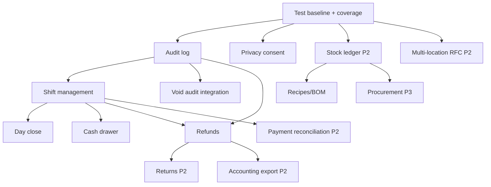

# Master Implementation Plan — FloCafe → RestaurantOS

**Status:** Planning only (no application code modified)  
**Source of truth:** Verified docs (`docs/`) + FloCafe v3.0.5 codebase (schema v66)  
**Last updated:** 2026-08-12

This document is the **authoritative implementation roadmap**. Summary views live in `implementation-plan.md`, `roadmap.md`, and `milestones.md` and must stay consistent with this plan.

---

## 1. Executive summary

RestaurantOS evolves FloCafe incrementally on the **existing stack** (Electron + Express + SQLite + Next.js). No microservices, no mandatory cloud, no AI dependency for core POS.

**Near-term focus (P1):** restaurant operations that FloCafe lacks today — shifts, cash reconciliation, audit logging, refunds, and privacy consent — built on proven payment, void, and reporting foundations that already exist.

**Medium-term (P2):** inventory ledger, procurement, payment terminal adapters, service charges, multi-location **design only**.

**Long-term (P3):** online ordering, advanced analytics, optional AI.

Estimated sequencing: **~6–9 months** of focused product development after engineering foundation (team-size dependent). This is a planning estimate, not a commitment.

---

## 2. Current baseline

### What exists today (VERIFIED — do not reimplement)

| Area | BUILT capabilities | Evidence |
|------|-------------------|----------|
| POS & orders | Cart, lifecycle, held orders, barcode, void/cancel items | `feature-list.md` |
| Payments | Bills, split/partial payments, idempotency, txn refs | `main/routes/bills.ts` |
| Kitchen | KDS, KOT, stations, printer routing | `main/kds-server.ts`, issue-134 tests |
| Printing | Network/USB/WebUSB ESC/POS, print_logs | `main/printers/thermal.ts` |
| Inventory (basic) | track_inventory, stock adjust, decrement, low_stock filter | `main/routes/products.ts`, `orders.ts` |
| Staff & auth | JWT, 5 roles, manager/master PIN | `main/routes/auth.ts`, `staff.ts` |
| Tax | Pack-based engine v66 | `main/services/tax-engine.ts` |
| Data safety | Migrations v1–66, pre-migration backup, restore | `main/db.ts`, `tests/upgrade-path.test.ts` |
| Reports | daily-stats, sales, tax-components, insights | `main/routes/reports.ts` |
| Integrations | Cloud sync outbox, WhatsApp, Google Drive, RevFlo pairing | `main/services/` |

### What is explicitly NOT BUILT (planning targets)

Shifts, refunds, returns, tips, cash drawer kick, configurable service charge, stock ledger, recipes/BOM, suppliers/POs, payment terminals, multi-location, online ordering, general audit log, explicit telemetry consent.

### Architectural constraints (preserve unless proven insufficient)

- Single SQLite writer per install (`better-sqlite3` sync API)
- Three LAN servers sharing one DB (:3001 / :3002 / :3003)
- Offline-first; billing never blocks on cloud
- Role-based auth (no RBAC table today)

---

## 3. Product strategy

1. **Operational completeness first** — restaurants cannot run accountable service without shifts, audit trail, and refunds.
2. **Extend, don't replace** — ledger extends `products.stock_quantity`; refunds extend `bills`/`payment_transaction_refs`; audit extends `print_logs` pattern.
3. **Single-location excellence** — multi-location is design-only until single-location ops are production-grade.
4. **Adapter pattern for externals** — payment terminals, delivery, accounting export via integration boundaries.
5. **Privacy by design** — fix default-on telemetry/diagnostics before scaling deployments.

---

## 4. Architectural principles

| Principle | Rationale |
|-----------|-----------|
| Monolithic Electron + Express | Adequate for LAN single-writer POS; verified in production FloCafe |
| Business logic in services over time | Reduce fat routes (`orders.ts`, `bills.ts`) without layer explosion |
| Additive SQLite migrations only | `AGENTS.md` data safety; upgrade-path tests mandatory |
| Feature flags via `settings` | Existing pattern (`kds_enabled`, etc.) |
| Integration adapters | `main/integrations/` (PROPOSED) — no vendor SDK in core routes |
| Tests define acceptance | Integration tests for money paths; upgrade-path for schema |
| Documentation follows code | `docs/00-product/feature-list.md` updated when features ship |

**Explicitly excluded:** microservices, Kubernetes, Kafka, Redis, Temporal, CQRS/event sourcing, mandatory cloud infra.

---

## 5. Implementation phases

### Phase 0 — Engineering foundation

**Objective:** Safe, measurable development environment before product features.

**Not product P0.** Migration extraction is **Eng P1 / Product P3**.

| Work item | Type | Priority | Effort | Risk |
|-----------|------|----------|--------|------|
| Baseline test gate documented | Eng | P0 | XS | LOW |
| Coverage measurement (c8) on payment/tax/auth | Eng | P0 | S | LOW |
| Upgrade-path + fresh-install CI gate | Eng | P0 | XS | LOW |
| Backup/restore verification checklist | Eng | P0 | S | LOW |
| `.env.example` + port documentation | Eng | P1 | XS | LOW |
| OpenAPI generation from routes (script) | Eng | P1 | M | LOW |
| Extract migrations from `db.ts` | Eng | Eng P1 | L | MEDIUM |
| Order/bill service extraction (no behavior change) | Eng | Eng P1 | L | MEDIUM |

**Validation:** `npm test`, `npm run test:upgrade-path`, coverage report artifact, manual backup/restore checklist passed.

**Rollback:** Engineering changes are behavior-preserving; rollback = revert commit.

---

### Phase 1 — Restaurant operations core

**Objective:** Accountable daily restaurant service — shifts, cash, audit, refunds, privacy.

#### 1.1 General audit logging

| Field | Detail |
|-------|--------|
| **Why** | Only `print_logs` and `tax_config_audit` exist; payment/void/refund actions are not centrally auditable |
| **When** | First P1 deliverable (foundation for shifts/refunds) |
| **Where** | `main/services/audit-log.ts` (PROPOSED), `main/routes/`, append-only `audit_logs` table |
| **Affects** | All routes that mutate money, auth, or destructive ops |
| **DB** | NEW `audit_logs` (id, actor_user_id, action, entity_type, entity_id, details_json, created_at) — migration v67+ |
| **API** | `GET /api/audit-logs` (owner/manager, paginated); internal write helper |
| **UI** | Settings → Audit viewer (owner); no operator friction on write path |
| **IPC** | None initially |
| **Tests** | Unit: log writer; integration: void payment creates audit row |
| **Migration** | Additive table + indexes |
| **Acceptance** | Every refund/void/shift action produces immutable audit row; no PII in details_json |
| **Dependencies** | Phase 0 test baseline |
| **Risks** | Log volume; MEDIUM — retention policy needed |

**User stories:** US-AUD-01 (owner views who voided a bill), US-AUD-02 (manager exports audit for accountant).

**Existing functionality preserved:** `print_logs`, `tax_config_audit` remain; audit_logs is additive.

---

#### 1.2 Privacy / telemetry consent

| Field | Detail |
|-------|--------|
| **Why** | CURRENT: `telemetry_enabled='true'` and `diagnostics_consent='true'` seeded by default (`seedInstallDefaults`) — privacy concern |
| **When** | P1 — before wide RestaurantOS deployment |
| **Where** | `main/db.ts` seed defaults, `frontend/settings` Privacy tab, `main/services/telemetry.ts`, `cloud-sync.ts` |
| **Affects** | First-run setup, settings, telemetry send paths |
| **DB** | Settings keys only; optional `consent_recorded_at` setting |
| **API** | `PUT /api/settings` privacy keys; block send until consent recorded (TARGET behavior) |
| **UI** | First-run consent screen; Settings → Privacy |
| **IPC** | None |
| **Tests** | Fresh install: no telemetry send until consent; opt-out persists |
| **Migration** | Settings-only migration for existing installs (preserve explicit opt-outs) |
| **Acceptance** | New installs require explicit consent before first telemetry/diagnostics transmission (TARGET) |
| **Dependencies** | Product/legal decision on default for upgraded installs |
| **Risks** | Regulatory interpretation; MEDIUM |

**Note:** CURRENT STATE remains default-on until this ships. Document in release notes.

---

#### 1.3 Shift management

| Field | Detail |
|-------|--------|
| **Why** | No shift entity; cash accountability impossible |
| **When** | P1 after audit log |
| **Where** | `main/routes/shifts.ts` (PROPOSED), `main/services/shift.ts`, `frontend` POS status bar + shift modal |
| **Affects** | Payment flows (optional: require open shift for cash) |
| **DB** | NEW `shifts` (id, opened_by, closed_by, opened_at, closed_at, opening_float, expected_cash, counted_cash, status, notes) |
| **API** | `POST /api/shifts/open`, `POST /api/shifts/:id/close`, `GET /api/shifts/current`, `GET /api/shifts` |
| **UI** | Shift open/close in POS; shift status in StatusBar |
| **IPC** | None |
| **Tests** | Integration: open → orders → close; cannot close with open bills (policy TBD) |
| **Migration** | Additive v67+ |
| **Acceptance** | One active shift per terminal/session policy; close produces reconciliation summary |
| **Dependencies** | Audit log (1.1) |
| **Risks** | Policy decisions (multi-cashier); MEDIUM |

---

#### 1.4 Cash drawer management

| Field | Detail |
|-------|--------|
| **Why** | No drawer kick command in `thermal.ts` |
| **When** | P1 with shift management |
| **Where** | `main/printers/thermal.ts`, printer profiles, POS payment success handler |
| **Affects** | Payment completion, printer settings |
| **DB** | Optional `printers.drawer_kick_enabled` column or settings key |
| **API** | `POST /api/printers/:id/kick-drawer` (PROPOSED) |
| **UI** | Settings → Printers; auto-kick on cash payment toggle |
| **IPC** | Possible IPC for desktop-only kick |
| **Tests** | Mock printer: kick ESC/POS bytes sent |
| **Migration** | Settings or additive column |
| **Acceptance** | Cash payment triggers drawer kick when enabled and printer supports it |
| **Dependencies** | Shift management (recommended), existing printer stack |
| **Risks** | Hardware variance; MEDIUM |

**Existing:** Payment recording BUILT — extend, do not replace.

---

#### 1.5 Day close / Z-report

| Field | Detail |
|-------|--------|
| **Why** | Reports API exists but no formal day-close gate (PARTIAL) |
| **When** | P1 after shifts |
| **Where** | `main/routes/reports.ts`, `main/services/day-close.ts` (PROPOSED), dashboard |
| **Affects** | Shift close, reports |
| **DB** | NEW `day_closes` (id, business_date, closed_by, summary_json, created_at) |
| **API** | `POST /api/reports/day-close`, `GET /api/reports/day-close/:date` |
| **UI** | Manager dashboard → End of day |
| **Tests** | Integration: day close snapshot matches sales summary |
| **Acceptance** | Day close produces immutable summary; optional block on new orders after close (policy) |
| **Dependencies** | Shift management, audit log |
| **Risks** | Timezone boundaries; MEDIUM |

**Existing:** `GET /api/reports/*` BUILT — day close aggregates existing data.

---

#### 1.6 Void handling (enhancement)

| Field | Detail |
|-------|--------|
| **Why** | Voids BUILT (`cancel-override`, item cancel) but not fully audited |
| **When** | P1 with audit log |
| **Where** | `main/routes/index.ts`, `main/routes/orders.ts` |
| **Affects** | Existing void/cancel flows |
| **DB** | No schema change required |
| **API** | Existing PATCH endpoints — add audit log calls |
| **UI** | No change required initially |
| **Tests** | Extend `cancel-override.test.ts` — audit row created |
| **Acceptance** | Every void/cancel writes audit_logs entry with manager PIN reference |
| **Dependencies** | Audit log (1.1) |
| **Risks** | LOW |

**Do not reimplement voids** — extend with audit trail.

---

#### 1.7 Refunds

| Field | Detail |
|-------|--------|
| **Why** | NOT BUILT — voids ≠ payment reversal |
| **When** | P1 after audit log + shifts |
| **Where** | `main/routes/refunds.ts` (PROPOSED), `main/services/refund.ts`, PaymentModal/history UI |
| **Affects** | `bills`, `payment_transaction_refs`, loyalty_ledger, inventory restock rules |
| **DB** | NEW `refunds` (id, bill_id, amount, method, reason, approved_by, status, created_at); link to audit_logs |
| **API** | `POST /api/bills/:id/refund`, `GET /api/refunds` |
| **UI** | Order history → Refund (manager PIN) |
| **Tests** | Integration: partial/full refund; decimal integrity; idempotency |
| **Acceptance** | Refund reduces paid_amount; creates audit + refund rows; cannot exceed paid total |
| **Dependencies** | Audit log, shift management (recommended) |
| **Risks** | Money integrity; HIGH — must reuse decimal.js patterns from bills.ts |

---

#### 1.8 Returns

| Field | Detail |
|-------|--------|
| **Why** | NOT BUILT — distinct from void (post-completion physical return) |
| **When** | P2 (after refunds) |
| **Where** | Extends refund workflow + order_items |
| **DB** | Extend `refunds` or `return_items` junction |
| **Dependencies** | Refunds (1.7), inventory ledger (Phase 2) if restock |
| **Risks** | MEDIUM |

**Phase 1 scope:** Design interface; minimal MVP may fold into refund with `reason=return`.

---

#### 1.9 Permission improvements

| Field | Detail |
|-------|--------|
| **Why** | Role-only RBAC (PARTIAL); refund/shift need tighter gates |
| **When** | P1 alongside refunds/shifts |
| **Where** | `main/middleware/security.ts`, route `requireRole` |
| **DB** | Optional future `permissions` table — **defer** to P2 unless needed |
| **Approach** | Extend `requireRole` for new routes; document matrix in `07-security/permissions.md` |
| **Dependencies** | None |
| **Risks** | LOW |

---

### Phase 2 — Inventory

**Objective:** Extend BUILT basic stock tracking — do **not** duplicate `track_inventory` / `POST /api/products/:id/stock`.

| Feature | Priority | Effort | Builds on |
|---------|----------|--------|-----------|
| Stock movement ledger | P2 | M | `products.stock_quantity`, `orders.ts` decrement |
| Stock adjustments (reason codes) | P2 | S | Existing stock POST |
| Low-stock UI alerts | P2 | S | Existing `?low_stock=true` API |
| Menu 86 / availability workflow | P2 | S | Existing `products.is_active` |
| Ingredients + recipes/BOM | P2 | L | Ledger |
| Ingredient consumption on order | P2 | L | Recipes + orders |
| Wastage tracking | P2 | M | Ledger |
| Stock transfers | P3 | M | Ledger, optional multi-location |
| Inventory counts (cycle count) | P3 | M | Ledger |

**DB (PROPOSED):** `stock_movements` (append-only), `ingredients`, `recipes`, `recipe_items`.

**Validation:** Ledger sum matches `products.stock_quantity`; upgrade-path test; no change to existing decrement until ledger backfill strategy defined.

---

### Phase 3 — Procurement

**Objective:** Supplier-to-stock workflow. **NOT BUILT** today.

| Feature | Priority | Effort |
|---------|----------|--------|
| Suppliers master | P2 | S |
| Purchase orders | P2 | M |
| Receiving / stock-in | P2 | M |
| Purchase invoices (record) | P3 | M |
| Supplier pricing history | P3 | S |
| Purchase returns | P3 | M |

**Dependencies:** Phase 2 stock ledger.

**Where:** `main/routes/suppliers.ts`, `purchase-orders.ts` (PROPOSED).

---

### Phase 4 — Payments & hardware

**Objective:** Adapter-based externals; extend BUILT printing.

| Feature | Status today | Plan |
|---------|--------------|------|
| Receipt/kitchen printers | BUILT | Maintain; optional Bluetooth P3 |
| Printer routing | BUILT (stations) | Maintain |
| Barcode scanner | BUILT (keyboard wedge) | Maintain |
| Cash drawer | NOT BUILT | Phase 1.4 |
| Payment terminals | NOT BUILT | P2 adapter interface |
| Customer display | NOT BUILT | P3 |
| Tips | NOT BUILT | P2 with payment flow |
| Service charge (configurable) | NOT BUILT (infra only) | P2 — extend orders.ts (currently `service_charge: 0`) |
| Payment reconciliation | PARTIAL | P1 shifts + P2 terminal adapter |

**Adapter (PROPOSED):**

```
main/integrations/payments/
  PaymentTerminalAdapter (interface)
  ManualTerminalAdapter (default — current behavior)
  StripeTerminalAdapter (example — P3 eval)
```

No vendor lock-in in core routes.

---

### Phase 5 — Multi-location (design only)

**CURRENT:** Single SQLite DB per install; no `locations` table.

**PROPOSED (RFC — do not implement yet):**

- Hub-and-spoke: each location = separate install with local SQLite
- Cloud hub for config + aggregated reporting (extends `cloud-sync.ts`)
- No multi-writer SQLite across locations

**Deliverable:** ADR-006 Multi-location model + migration impact analysis.

**Dependencies:** Phase 1 ops complete; cloud sync stable.

---

### Phase 6 — Online & external integrations

| Integration | Status | Plan |
|-------------|--------|------|
| WhatsApp | BUILT | Maintain; monitor Baileys RC |
| Cloud / FloAdmin | BUILT (partial) | P2 config sync |
| Google Drive backup | BUILT | Maintain |
| RevFlo mobile | BUILT | Maintain |
| Online ordering | NOT BUILT | P3 webhook outbox adapter |
| Delivery aggregators | NOT BUILT | P3 adapter |
| Accounting export | NOT BUILT | P2 CSV/API export |

**Pattern:** Durable outbox (same as `cloud_sync_outbox`) for inbound orders.

---

### Phase 7 — Analytics

**Objective:** Extend BUILT reports — non-blocking.

| Feature | Builds on |
|---------|-----------|
| Sales dashboards | `reports.ts` |
| Product performance | `topProducts` |
| Staff performance | shifts + audit_logs (Phase 1) |
| Inventory analytics | stock_movements (Phase 2) |
| Waste analytics | wastage (Phase 2) |
| Payment reconciliation reports | shifts + payment_transaction_refs |

**Rule:** Analytics read-only; never block order/payment path.

---

### Phase 8 — Optional AI

**Not a core dependency.** Every feature must work with AI disabled.

| Feature | Priority | Data needed | Fallback |
|---------|----------|-------------|----------|
| Demand forecasting | P3 | Historical orders | Manual par levels |
| Inventory recommendations | P3 | stock_movements | Low-stock alerts |
| Anomaly detection | P3 | audit_logs, payments | Manager review |
| NL reports | P3 | reports API | Standard dashboards |

**Requirements per feature:** business value doc, privacy review, cost cap, offline fallback — see `docs/10-ai/`.

---

## 6. Feature backlog (prioritized)

| ID | Feature | Priority | Effort | Risk | Phase | Status today |
|----|---------|----------|--------|------|-------|--------------|
| F-001 | Engineering test baseline | P0 | S | LOW | 0 | PARTIAL |
| F-002 | Coverage measurement | P0 | S | LOW | 0 | NOT BUILT |
| F-003 | Audit log | P1 | M | MED | 1 | PARTIAL |
| F-004 | Privacy consent | P1 | M | MED | 1 | PARTIAL |
| F-005 | Shift management | P1 | L | MED | 1 | NOT BUILT |
| F-006 | Cash drawer kick | P1 | M | MED | 1 | NOT BUILT |
| F-007 | Day close / Z-report | P1 | M | MED | 1 | PARTIAL |
| F-008 | Refunds | P1 | L | HIGH | 1 | NOT BUILT |
| F-009 | Void audit integration | P1 | S | LOW | 1 | BUILT void + audit gap |
| F-010 | Permission matrix update | P1 | S | LOW | 1 | PARTIAL |
| F-011 | Stock movement ledger | P2 | M | MED | 2 | NOT BUILT |
| F-012 | Recipe/BOM | P2 | L | MED | 2 | NOT BUILT |
| F-013 | 86 / availability UX | P2 | S | LOW | 2 | PARTIAL |
| F-014 | Service charge POS | P2 | M | MED | 4 | NOT BUILT |
| F-015 | Tips | P2 | M | MED | 4 | NOT BUILT |
| F-016 | Payment terminal adapter | P2 | L | HIGH | 4 | NOT BUILT |
| F-017 | Suppliers + PO | P2 | L | MED | 3 | NOT BUILT |
| F-018 | Accounting export | P2 | M | LOW | 6 | NOT BUILT |
| F-019 | Multi-location RFC | P2 | M | HIGH | 5 | NOT BUILT |
| F-020 | Online ordering adapter | P3 | XL | HIGH | 6 | NOT BUILT |
| F-021 | Bluetooth printing | P3 | M | MED | 4 | NOT BUILT |
| F-022 | AI forecasting | P3 | L | MED | 8 | NOT BUILT |
| F-023 | Migration extraction | Eng P1 | L | MED | 0 | NOT BUILT |

---

## 7. Dependency graph



**Critical path to RestaurantOS 1.0 ops:** P0 → Audit → Shifts → Refunds → Day close.

---

## 8. Priority matrix

|  | P0 Foundation | P1 Critical | P2 Important | P3 Future |
|--|---------------|-------------|--------------|-----------|
| **Product** | — | Shifts, audit, refunds, privacy, day close | Inventory ledger, PO, terminals, service charge | Online order, AI, Bluetooth |
| **Engineering** | Test baseline, CI gates | Coverage, OpenAPI | Migration extract, service extract | Sandbox spike |

---

## 9. Engineering vs product work

| Category | Examples | Priority label |
|----------|----------|----------------|
| **Product** | Shifts, refunds, audit UI, consent screen | P1–P3 |
| **Engineering** | Migration extract, c8 coverage, OpenAPI script | P0–Eng P1 |
| **Docs/legal** | Privacy policy, LAN security guide | P1 |
| **Design only** | Multi-location RFC | P2 (no code) |

**Rule:** Engineering P0 gates all product P1 work (tests must pass before feature branches merge).

---

## 10. Testing strategy per phase

| Phase | Required tests |
|-------|----------------|
| 0 | `npm test`, upgrade-path, coverage baseline on bills/orders/auth |
| 1 | Integration: shift lifecycle, refund decimal integrity, audit row creation, consent gating |
| 2 | Ledger reconciliation vs stock_quantity; recipe consumption |
| 3 | PO receive → stock_movement |
| 4 | Adapter mock tests; drawer kick bytes |
| 5 | RFC review only |
| 6 | Outbox replay; export CSV golden files |
| 7 | Report snapshot tests |
| 8 | AI eval sets (offline fixtures) |

Existing suites to extend (not replace): `integration-payments`, `cancel-override`, `upgrade-path`, `backup-restore`.

---

## 11. Migration strategy

1. **Append-only** migrations in `main/db.ts` MIGRATIONS[] (or extracted modules later)
2. **Never edit** existing migration entries
3. **Pre-migration backup** automatic (existing)
4. **Upgrade-path test** required for every schema change
5. **Fresh-install test** via `schema-health.test.ts`
6. Version bump: next migration **v67** for first RestaurantOS schema change

**Rollback:** Restore pre-migration backup; downgrade app version if schema mismatch.

---

## 12. Rollback strategy

| Change type | Rollback |
|-------------|----------|
| Additive migration | Restore backup; reinstall previous app version |
| Settings-only | Revert settings via defaults |
| Feature flag off | Disable via `settings` key |
| Engineering refactor | Git revert; no schema change |

Every release: document minimum app version for DB schema in CHANGELOG.

---

## 13. Risk register

See `docs/15-project-management/risks.md`. Additional implementation risks:

| ID | Risk | Phase | Mitigation |
|----|------|-------|------------|
| R-15 | Refund decimal drift | 1 | Reuse bills.ts patterns; integration tests |
| R-16 | Shift policy ambiguity | 1 | Document single-active-shift policy in ADR |
| R-17 | Audit log PII leakage | 1 | Schema review; no customer phone in details |
| R-18 | Scope creep on inventory | 2 | Ship ledger before recipes |
| R-19 | Payment terminal vendor lock | 4 | Adapter interface only in core |

---

## 14. Technical debt strategy

Address in parallel with features (see `technical-debt.md`):

| When | Debt item |
|------|-----------|
| Eng P1 (parallel) | TD-01 migration extract, TD-08 coverage |
| After Phase 1 | TD-02 order/bill service extract |
| P2 | TD-05 sandbox spike |
| P3 | TD-11 OpenAPI fully replaces API.md |

**Do not** block Phase 1 product work on migration extraction.

---

## 15. Release strategy

| Milestone | Release type | Contents |
|-----------|--------------|----------|
| M1–M2 | Internal alpha | Engineering baseline + privacy |
| M3–M5 | Beta | Shifts + audit + day close |
| M6 | Beta | Refunds |
| M7+ | Minor semver | Inventory, procurement per phase |

**Gates:** `npm run lint`, `npm run build`, `npm test`, upgrade-path, Playwright E2E for touched UI.

**Naming:** RestaurantOS rebrand is optional and independent of feature releases.

See `docs/00-product/release-plan.md`.

---

## 16. Definition of Done

A feature is **done** when:

- [ ] Acceptance criteria met (documented in feature spec or this plan)
- [ ] Additive migration (if any) + upgrade-path test passes
- [ ] Integration tests added/extended
- [ ] `docs/00-product/feature-list.md` updated (BUILT/PARTIAL/NOT BUILT)
- [ ] API documented in `docs/05-api/` or OpenAPI
- [ ] No regression in `npm test`
- [ ] Audit log entry (if money/auth action)
- [ ] Runbook updated (if operational impact)

---

## 17. First 10 implementation milestones

### M1 — Engineering baseline

| Field | Detail |
|-------|--------|
| **Objective** | Measurable, safe development gate |
| **Scope** | c8 coverage on payment/tax/auth; document test gate; verify backup/restore checklist |
| **Modules** | `tests/`, `package.json` scripts, `docs/09-testing/` |
| **DB impact** | None |
| **API impact** | None |
| **UI impact** | None |
| **Tests** | Coverage report; existing `npm test` green |
| **Acceptance** | Coverage artifact in CI; backup/restore manual checklist signed off |
| **Dependencies** | Documentation complete (done) |
| **Rollback** | Revert CI config only |

---

### M2 — Privacy & consent (TARGET behavior)

| Field | Detail |
|-------|--------|
| **Objective** | Explicit consent before telemetry/diagnostics transmission |
| **Scope** | First-run + settings UX; gate `telemetry.ts` and diagnostics send |
| **Modules** | `main/db.ts` seeds, `main/services/telemetry.ts`, `frontend/settings`, `frontend/setup` |
| **DB impact** | Settings migration (preserve existing opt-outs) |
| **API impact** | Settings GET/PUT privacy keys |
| **UI impact** | Consent screen, Privacy tab updates |
| **Tests** | Fresh install consent; opt-out persistence |
| **Acceptance** | No telemetry send until consent recorded (TARGET) |
| **Dependencies** | M1; product/legal sign-off |
| **Rollback** | Feature flag `require_explicit_consent=false` in settings |

---

### M3 — Audit log foundation

| Field | Detail |
|-------|--------|
| **Objective** | Central immutable audit trail for financial/auth actions |
| **Scope** | `audit_logs` table + write helper + owner read API |
| **Modules** | `main/db.ts`, `main/services/audit-log.ts`, `main/routes/audit-logs.ts`, settings UI |
| **DB impact** | Migration v67: `audit_logs` |
| **API impact** | `GET /api/audit-logs` |
| **UI impact** | Settings → Audit log viewer |
| **Tests** | Integration: action → audit row |
| **Acceptance** | Owner can query paginated audit trail |
| **Dependencies** | M1 |
| **Rollback** | Migration additive; feature unused if not wired |

---

### M4 — Shift open/close

| Field | Detail |
|-------|--------|
| **Objective** | Track cashier sessions with opening float |
| **Scope** | Shift CRUD, current shift API, POS UI |
| **Modules** | `main/routes/shifts.ts`, `frontend/pos`, `StatusBar.tsx` |
| **DB impact** | Migration: `shifts` |
| **API impact** | `/api/shifts/*` |
| **UI impact** | Shift modal, status indicator |
| **Tests** | Integration: open → activity → close |
| **Acceptance** | Cannot have two open shifts (single-terminal policy) |
| **Dependencies** | M3 |
| **Rollback** | Disable shift requirement flag; tables remain empty |

---

### M5 — Cash reconciliation & day close

| Field | Detail |
|-------|--------|
| **Objective** | End-of-day accountability |
| **Scope** | Shift close with counted cash; day close report snapshot |
| **Modules** | `main/routes/shifts.ts`, `main/routes/reports.ts`, dashboard |
| **DB impact** | `day_closes` table; shift close fields |
| **API impact** | `POST /api/shifts/:id/close`, `POST /api/reports/day-close` |
| **UI impact** | Close shift wizard; day close button |
| **Tests** | Reconciliation math; day close JSON snapshot |
| **Acceptance** | Expected vs counted cash variance recorded and audited |
| **Dependencies** | M4, M3 |
| **Rollback** | Day close optional; shifts still work |

---

### M6 — Refund workflow

| Field | Detail |
|-------|--------|
| **Objective** | Post-payment reversal with audit |
| **Scope** | Full/partial refund against bill |
| **Modules** | `main/routes/refunds.ts`, `main/routes/bills.ts`, order history UI |
| **DB impact** | `refunds` table |
| **API impact** | `POST /api/bills/:id/refund` |
| **UI impact** | Refund dialog (manager PIN) |
| **Tests** | `integration-refunds.test.ts`; decimal integrity |
| **Acceptance** | Refund ≤ paid amount; audit + refund rows; payment_status updated |
| **Dependencies** | M3, M4 (recommended) |
| **Rollback** | Hide refund UI; API returns 503 if disabled |

---

### M7 — Void/comp audit integration

| Field | Detail |
|-------|--------|
| **Objective** | Complete audit coverage for existing void flows |
| **Scope** | Wire audit_logs into cancel/void endpoints |
| **Modules** | `main/routes/index.ts`, `main/routes/orders.ts` |
| **DB impact** | None |
| **API impact** | None (behavior additive) |
| **UI impact** | None |
| **Tests** | Extend `cancel-override.test.ts` |
| **Acceptance** | 100% void/cancel paths write audit |
| **Dependencies** | M3 |
| **Rollback** | Remove audit calls only |

---

### M8 — Cash drawer kick

| Field | Detail |
|-------|--------|
| **Objective** | Open drawer on cash payment |
| **Scope** | ESC/POS kick command + settings |
| **Modules** | `main/printers/thermal.ts`, `main/routes/printers.ts`, settings |
| **DB impact** | Settings or printer column |
| **API impact** | `POST /api/printers/:id/kick-drawer` |
| **UI impact** | Printer settings toggle |
| **Tests** | Mock kick bytes |
| **Acceptance** | Kick fires on cash payment when enabled |
| **Dependencies** | M4, existing printer stack |
| **Rollback** | Disable auto-kick setting |

---

### M9 — Stock movement ledger

| Field | Detail |
|-------|--------|
| **Objective** | Append-only inventory history |
| **Scope** | Ledger table; write on adjust/decrement/order |
| **Modules** | `main/routes/products.ts`, `main/routes/orders.ts`, inventory UI |
| **DB impact** | `stock_movements` |
| **API impact** | `GET /api/stock-movements`; extend stock POST |
| **UI impact** | Inventory history in products page |
| **Tests** | Ledger sum reconciles with stock_quantity |
| **Acceptance** | Every stock change has movement row with reason |
| **Dependencies** | M1; **extends** existing stock — does not replace |
| **Rollback** | Stop writing movements; keep table |

---

### M10 — Multi-location RFC (design only)

| Field | Detail |
|-------|--------|
| **Objective** | Approved architecture before any multi-location code |
| **Scope** | ADR-006 document only |
| **Modules** | `docs/14-decisions/ADR-006-multi-location.md` |
| **DB impact** | None (design) |
| **API impact** | None |
| **UI impact** | None |
| **Tests** | N/A — review checklist |
| **Acceptance** | ADR approved by maintainers; migration impact documented |
| **Dependencies** | M1–M6 ops stable |
| **Rollback** | N/A — document only |

---

## Appendix A — Phase 1 feature specs (quick reference)

| Feature | Existing to preserve | Do not rebuild |
|---------|---------------------|----------------|
| Partial payments | `payment_status='partial'` in bills.ts | Split payment logic |
| Void/cancel | Manager PIN, inventory rules | Cancel endpoints |
| Print audit | `print_logs` | Receipt printing |
| Tax audit | `tax_config_audit` | Tax engine |
| Reports | All `/api/reports/*` | Aggregation queries |
| Stock adjust | `POST /api/products/:id/stock` | track_inventory flag |

---

## Appendix B — Document cross-references

| Topic | Document |
|-------|----------|
| Feature status | `docs/00-product/feature-list.md` |
| Architecture | `docs/03-architecture/architecture.md` |
| Gap summary | `docs/15-project-management/implementation-plan.md` |
| Timeline view | `docs/00-product/roadmap.md` |
| Release gates | `docs/00-product/release-plan.md` |
| Audit corrections | `docs/audits/second-pass-audit.md` |
